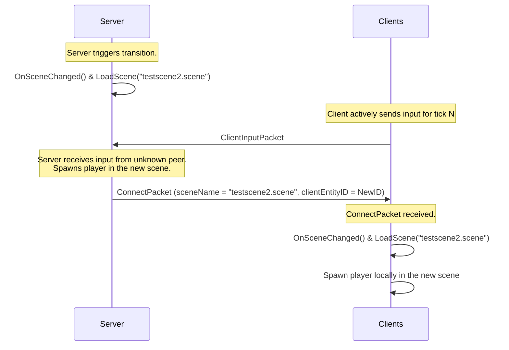

# Data Synchronization, Physics, and Scene Transitions

This document explains the architecture of state synchronization, client-side input prediction, server-authoritative physics, desync reconciliation, and network-synced scene transitions in ShawntyEngine.

---

## 1. Registry Architecture & State Ownership

ShawntyEngine is built on a server-authoritative Entity Component System (ECS) registry model.

| Feature / Role | Server Registry (`m_IsServer = true`) | Client Registry (`m_IsServer = false`) |
| :--- | :--- | :--- |
| **Ground / Environment** | Authoritative Static Colliders | Replicated Colliders + Visual Sprites |
| **Local Player** | Simulated Rigid Body (Authoritative) | Dynamic Rigid Body (Locally Predicted) |
| **Remote Players** | Simulated Rigid Body (Authoritative) | Kinematic Rigid Body (Interpolated Proxies) |
| **Visual Sprites / UI** | Stripped (Headless Execution) | Rendered Sprites + HUD |

All player positioning and velocity data are owned by the server. The client registry contains:
1. **Local Player (`m_MyLocalPlayerID`)**: Runs local input predictions to eliminate responsiveness lag.
2. **Remote Player Proxies**: Replicated entities controlled by server position updates. Their gravity, drag, and forces are disabled client-side (set to Kinematic mode) to prevent local physics drift.

---

## 2. Client Input & Prediction Loop

To make controls feel instantaneous, ShawntyEngine implements client-side prediction:

```cpp
// 1. Read keyboard inputs and encode into an inputMask
uint16_t inputMask = OnGenerateInputMask(m_Input);

// 2. Transmit inputMask to server immediately
SendClientInput(inputMask, 0.0f, 0.0f);

// 3. Apply the input mask locally to the local player entity
OnApplyInput(m_MyLocalPlayerID, inputMask);

// 4. Store predicted coordinates in history buffer
m_ClientStateHistory[m_ClientTick] = { trans.position, rb.GetVelocity() };
```

Every frame, the client generates an input mask representing keypresses. It sends this mask to the server and immediately runs `OnApplyInput()` to update its local velocity and transform, saving the result in a history buffer indexed by the current client tick.

---

## 3. Server Tick & Physics Simulation

The server and clients operate on a unified fixed 60Hz tick loop (`0.0166f`):

1. **Input Buffering**: Incoming client packets are placed in `m_BufferedPeerInputs` indexed by their client tick.
2. **Simulation Step**:
   - The server increments `m_ServerTick`.
   - For each connected player, the server retrieves the input mask for the current `m_ServerTick` from `m_BufferedPeerInputs`. If packet loss occurs, it falls back to repeating the player's last executed input mask.
   - It runs `OnApplyInput(playerEntityID, inputMask)` to apply acceleration/forces.
3. **Physics Update**:
   - `m_Physics.Update(tickInterval)` is called.
   - The physics system integrates gravity, moves bodies, and constructs a **Quadtree** spatial grid for collision detection.
   - Collisions are resolved authoritatively. Static ground keeps players from falling, trampolines add bounciness, and transparent player settings are enforced.
4. **State Broadcasting**:
   - Every tick, the server broadcasts lightweight `ServerUpdate` packets containing player velocities.
   - Every 15 ticks, the server broadcasts absolute `StateSync` coordinates.

---

## 4. Clock Sync & Desync snapping

Network latency means client inputs require time to travel to the server. If the client ran at the same tick as the server, its inputs would always arrive late, causing the server to miss ticks and execute default states.

### Latency Offset Compensation
To compensate, the client clock runs **ahead** of the server clock:

$$\text{ClientTick} = \text{ServerTick} + \text{rttTicks} + 5$$

Where `rttTicks` is the calculated round-trip time divided by tick duration ($16.67\text{ ms}$). The $+5$ tick buffer ensures that even with network jitter, the client's input packet arrives at the server *before* the server simulates that tick.

### Desync Snap and Reconciliation
When the client receives a `StateSync` packet at server tick `serverUpdateTick`, it compares the server's authoritative position against its historical predicted position at that tick:

```cpp
uint32_t reconTick = serverUpdateTick + 3; // Align with future projection
auto historyIt = m_ClientStateHistory.find(reconTick);

if (historyIt != m_ClientStateHistory.end()) {
    glm::vec2 predictedPos = historyIt->second.position;
    glm::vec2 error = serverPos - predictedPos;
    float errorLen = glm::length(error);

    if (errorLen > 1.5f) {
        // 1. HARD SNAP: Large desync detected, teleport client
        trans.position = serverPos;
        rb.SetVelocity(glm::vec2(0.0f));
        m_ClientStateHistory.clear();
    } else if (errorLen > 0.001f) {
        // 2. SOFT CORRECTION: Blend position and adjust historical buffer
        glm::vec2 correction = error * 0.5f;
        trans.position += correction;
        for (auto& [tick, state] : m_ClientStateHistory) {
            if (tick > reconTick) state.position += correction;
        }
    }
}
```

* **Hard Snap**: If the position error is greater than $1.5\text{ units}$, the client snap-teleports the player to the server position to correct collision penetration.
* **Soft Correction**: If the error is small, the client blends $50\%$ of the error into the current position and offsets the historical prediction states to prevent visual stuttering.

---

## 5. Scene Transitions & Self-Healing Spawns

ShawntyEngine implements a reliable scene transition workflow that cleans up old entities and automatically re-spawns players in the new level without interrupting the network socket:



1. **State Reset (`OnSceneChanged()`)**:
   - When the server decides to change scenes, it calls `OnSceneChanged()`, which cleanly flushes its active connection state (`m_PeerToEntity`). Crucially, **the server and client tick rates do not reset**, preventing timeline desyncs across levels.
   - The server loads the new JSON scene file.
2. **Organic Re-Connection**:
   - Because the client was never disconnected, it inevitably sends its next `ClientInputPacket` a split second later.
   - The server receives this input from a peer that is no longer in its active connections map. The server handles this organically as a "new connection" and automatically re-spawns the player in the new scene.
3. **Client Transition**:
   - The server replies with a fresh `ConnectPacket` containing the new `sceneName` and the player's new `clientEntityID`.
   - The client receives this packet, detects the scene change, entirely flushes its old prediction history and entity mappings, and natively loads the new scene.
