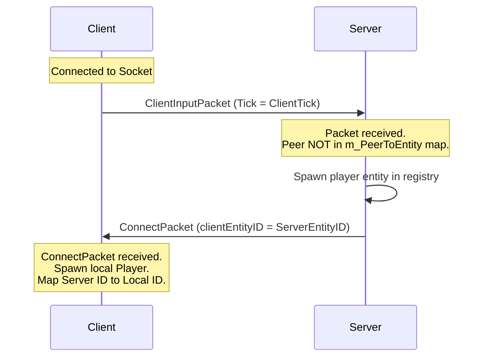

# Multiplayer Networking and Packets

This document describes the low-level communication protocols, packet structures, and connection management lifecycles utilized by the ShawntyEngine multiplayer framework.

---

## 1. Network Transport Protocol (ENet)

ShawntyEngine uses **ENet** for its transport layer. ENet sits on top of UDP and provides features that are critical for real-time multiplayer games:
* **Connection Management**: ENet handles the UDP connection state, handshakes, and timeouts.
* **Reliable and Unreliable Channels**: Packets can be sent over multiple channels. For example, high-frequency position updates are sent unreliably (discarded if lost), while critical actions (like scene switches or connection handshakes) are sent reliably (retransmitted if lost).
* **In-Order Delivery**: ENet ensures that reliable packets arrive in order per channel.

The engine initializes ENet and listens on port `7777` by default.

---

## 2. Packet Structures

All packets share a standard header, which determines their type and when they were generated:

```cpp
enum class PacketType : uint8_t {
    Connect = 0,
    ClientInput = 1,
    ServerUpdate = 2,
    StateSync = 3,
    TickSync = 4,
    ServerCommand = 5
};

struct PacketHeader {
    PacketType type;
    uint32_t tick; // Time stamp corresponding to the sender's simulation tick
};
```

### A. Connection Packet (`PacketType::Connect`)
Sent by the server to a client once a handshake is established. It designates the server-assigned Entity ID of the client's player character.

```cpp
struct ConnectPacket {
    PacketHeader header;
    uint32_t clientEntityID; // Authoritative Entity ID for the client's local player
};
```

### B. Client Input Packet (`PacketType::ClientInput`)
Sent by clients to the server at 60Hz. It carries the client's local tick and a bitmask of pressed keys.

```cpp
struct ClientInputPacket {
    PacketHeader header;
    uint16_t inputMask;     // Bitmask encoding keys (e.g., bit 0: Space, bit 1: W, bit 2: A, bit 3: D)
    float mouseDeltaX;      // Retained for camera/aiming extensions
    float mouseDeltaY;
};
```

### C. Server Update Packet (`PacketType::ServerUpdate`)
Sent by the server to all clients every frame (except on `StateSync` ticks). It contains velocity updates for all active players to assist client-side dead reckoning.

```cpp
struct EntityVelocityData {
    uint32_t entityID;
    float vx, vy;
};

// Layout: [PacketHeader] + [uint32_t count] + [EntityVelocityData * count]
```

### D. State Sync Packet (`PacketType::StateSync`)
Sent by the server to all clients every 15 ticks. It carries authoritative position coordinates. Clients use this packet to snap desyncs and smooth visual drift.

```cpp
struct EntityPositionData {
    uint32_t entityID;
    float x, y;
};

// Layout: [PacketHeader] + [uint32_t count] + [EntityPositionData * count]
```

### E. Tick Sync Packet (`PacketType::TickSync`)
Sent by the server to all clients every 60 ticks. It aligns the client and server clocks if they drift too far apart.

```cpp
// Layout: [PacketHeader]
```

### F. Server Command Packet (`PacketType::ServerCommand`)
Sent reliably by the server to direct clients to perform game-wide events, such as loading a new scene.

```cpp
struct ServerCommandPacket {
    PacketHeader header;
    char command[64]; // Example: "load_scene level2"
};
```

---

## 3. Connection Handshake Lifecycle

ShawntyEngine features a **self-healing connection handshake** that automatically spans scene transitions:



1. **Client Connects**: The client initiates an ENet connection via `Connect("ip", 7777)`.
2. **First Input Packet**: The client begins sending `ClientInputPacket` ticks.
3. **Server Registration**: The server receives the input packet, notices that the `ENetPeer` is not in its `m_PeerToEntity` map, and spawns the player entity using `OnSpawnPlayer()`. It maps the peer to the spawned `EntityID`.
4. **Welcome Packet**: The server returns a `ConnectPacket` containing the assigned `EntityID` and the authoritative server tick.
5. **Local Initialization**: The client receives the `ConnectPacket`, sets its clock synchronization offset, spawns a local player representation, and maps the server's `EntityID` to the client's local `EntityID`.

---

## 4. Disconnection Lifecycles

### Client Disconnection
* When a client disconnects (or times out), ENet fires an `ENET_EVENT_TYPE_DISCONNECT` event.
* The server catches this inside `NetworkService::PollEvents()` and routes it to `NetworkControl::OnClientDisconnected()`.
* The server calls the virtual method `OnDestroyPlayer(entity)` to clean up the player's registry assets and removes the peer from `m_PeerToEntity`.
* The server broadcasts the updated player list. On the next state update, clients detect the missing entity ID and destroy their local representation of that player.

### Administrative Grace Period
* If the admin client (the client that hosted the session, usually peer index 0) disconnects, the server logs:
  `Admin client disconnected! Starting 10s grace period...`
* The server keeps the session alive for 10 seconds. If the admin client reconnects within this period, the session continues.
* If the grace period expires without reconnection, the server calls `Auto-shutting down` and safely terminates the process to save resources.
